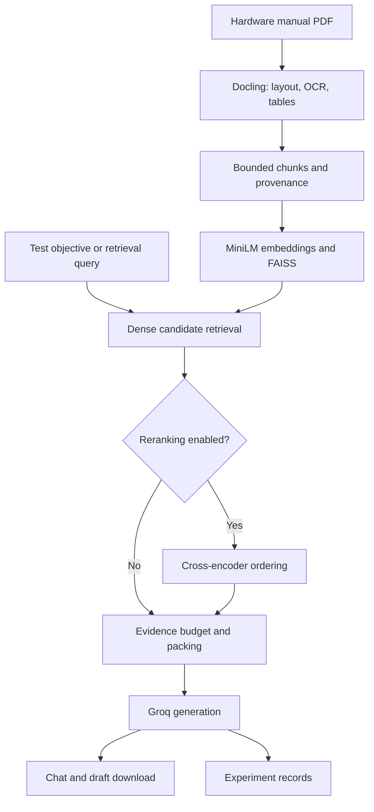

# Embedded Hardware Security Test Planner

**A configurable RAG baseline for generating and evaluating evidence-grounded security verification procedures from hardware manuals.**

This project combines local PDF parsing, token-bounded document chunks, dense retrieval, optional cross-encoder reranking, and cloud language-model generation. It provides an interactive Streamlit application and a command-line experiment runner for comparing retrieval configurations against a fixed benchmark.

The research objective is to determine which retrieval approach supplies enough accurate, traceable evidence to generate useful procedures and defensible pass/fail criteria—and which approach correctly identifies insufficient documentation.

**Version scope:** This README documents the `hardware_rag_update` package. Place this file at the updated project root as `README.md`.

## Contents

- [Current status](#current-status)
- [Research scope](#research-scope)
- [Architecture](#architecture)
- [Project files](#project-files)
- [Installation and startup](#installation-and-startup)
- [Interactive application](#interactive-application)
- [Configuration reference](#configuration-reference)
- [Token budgets and chunking](#token-budgets-and-chunking)
- [Evidence provenance and citations](#evidence-provenance-and-citations)
- [Retrieval configurations](#retrieval-configurations)
- [Generation and conversation state](#generation-and-conversation-state)
- [Benchmark preparation](#benchmark-preparation)
- [Running experiments](#running-experiments)
- [Experiment output reference](#experiment-output-reference)
- [Evaluation and annotation protocol](#evaluation-and-annotation-protocol)
- [Controlled comparisons and ablations](#controlled-comparisons-and-ablations)
- [Reproducibility](#reproducibility)
- [Tests and validation](#tests-and-validation)
- [Troubleshooting](#troubleshooting)
- [Data handling](#data-handling)
- [Limitations](#limitations)
- [Next development steps](#next-development-steps)

## Current status

The updated system is suitable for establishing an experimental baseline after a live document/model run and preparation of human-reviewed evaluation cases.

| Capability | Current implementation |
| --- | --- |
| PDF structure, OCR and table extraction | Docling with RapidOCR and table-structure recognition enabled |
| Document chunking | Hierarchical document elements, followed by tokenizer-aware splitting |
| Heading context | Parent headings prepended to embedding inputs |
| Dense retrieval | Normalized MiniLM embeddings and FAISS inner-product search |
| Reranking | Optional, lazily loaded cross-encoder |
| Evidence records | Document hashes, chunk IDs, headings, offsets and full parent provenance positions |
| Interactive drafting | Streamlit chat with evidence display and Markdown draft downloads |
| Experiment isolation | Fresh conversation state for every benchmark case and repeat |
| Experiment records | Manifest, indexed evidence snapshots and per-case JSONL records |
| Quality scoring | Human annotation protocol; automatic scoring is not implemented |
| Sparse or hybrid retrieval | Not implemented yet |
| Hardware execution | Not implemented |

No empirical retrieval, grounding, coverage or abstention results are claimed in this README. A working interface and passing regression tests are not measurements of security-test quality.

## Research scope

### Inputs

- A device manual or hardware specification in PDF format.
- A user question or security verification objective.
- Retrieval and generation settings.
- For experiments, a reviewed benchmark with reference evidence and expected behaviors.

The current application accepts a manually uploaded PDF. It does not detect connected hardware, identify its model, or automatically download the matching manual.

### Intended outputs

For a supported test-generation request, the prompt asks the model to produce:

1. Test ID and title.
2. Objective and documented requirement or behavior.
3. Source evidence.
4. Preconditions and required equipment.
5. Setup and configuration.
6. Ordered test steps.
7. Expected observations.
8. Measurable pass/fail criteria.
9. Limitations and missing information.

Document questions can receive ordinary answers without generating a procedure. General engineering guidance should be labeled separately from documented device behavior.

If the manual does not support the procedure or acceptance criteria, the prompt requests abstention and identification of missing information. This is a prompt instruction, not a code-enforced guarantee.

Generated procedures are proposed drafts for human review. The software does not demonstrate that a physical device was tested or that a requirement passed verification.

## Architecture



| Stage | Component | Execution | Role |
| --- | --- | --- | --- |
| PDF page validation | PyMuPDF | Local | Reads page count and enforces page limit |
| PDF conversion | Docling / RapidOCR | Local | Extracts document structure, OCR text and tables |
| Initial chunking | `HierarchicalChunker` | Local | Groups content using document structure |
| Budget enforcement | `src/chunking.py` | Local | Splits enriched text using encoder tokenizer offsets |
| Embedding | `sentence-transformers/all-MiniLM-L6-v2` | Local CPU | Encodes queries and chunks |
| Candidate search | FAISS `IndexFlatIP` | Local memory | Searches normalized dense vectors |
| Optional reranking | `cross-encoder/ms-marco-MiniLM-L-6-v2` | Local CPU | Scores query/passage pairs |
| Evidence packing | `HardwarePlanner` | Local | Selects whole evidence records within a proxy budget |
| Answer/test generation | Configured Groq model | Cloud API | Produces free-form answers and draft procedures |
| Review interface | Streamlit | Local web server | Displays sources and downloads active drafts |
| Experiment collection | `experiment_runner.py` | Local orchestration | Saves matched variant/case/repeat records |

Embedding and reranking loaders explicitly use CPU. Docling acceleration follows its configured library defaults; the code does not explicitly force a particular Docling accelerator.

## Project files

| Path | Purpose |
| --- | --- |
| `app.py` | Interactive UI, document state, retrieval controls and downloads |
| `run.py` | Creates `.venv`, installs dependencies when requirements change, launches Streamlit |
| `run.cmd` | Windows launcher wrapper |
| `requirements.txt` | Runtime dependency specifications |
| `experiment_runner.py` | Benchmark validation, matched variants, repetitions and output saving |
| `src/config.py` | Immutable retrieval and generation configuration dataclasses |
| `src/pdf_processor.py` | Document conversion, source filename and PDF SHA-256 |
| `src/chunking.py` | Token budgets, offsets, overlap, stable IDs and provenance |
| `src/vector_store.py` | FAISS indexing, dense search, optional reranking and exported settings |
| `src/chatbot.py` | Generation prompt, current-turn context, history handling and call records |
| `src/models.py` | Retained Pydantic requirement/test schemas; not enforced by current chat |
| `src/__init__.py` | Package initializer |
| `tests/test_workflow.py` | Chunk, retrieval, chat and experiment runner tests |
| `tests/test_app.py` | Current UI upload and state-reset regression |
| `benchmarks/example.json` | Unreviewed benchmark template |
| `VALIDATION.md` | Historical checks and explicit validation limits |
| `CHANGELOG.md` | Summary of the baseline update |

If migrating from the earlier prototype, remove its root-level `test_app.py` and `test_workflow.py`. They target obsolete interfaces. Use the updated `tests/` directory and rebuild document indexes.

## Installation and startup

### Requirements

- Python 3.11 or newer, as required by the launcher.
- A platform/environment capable of installing the dependencies in `requirements.txt`.
- Network access for initial package/model resources and live Groq generation.
- A Groq API key with access to your selected model.
- A representative hardware manual for live validation.

The package preparation checks used Python 3.12 on Linux. Other Python/platform combinations and the Windows launcher need validation in the target environment. Installation compatibility is ultimately determined by the dependency versions resolved on your machine.

### Windows quick start

Extract the updated package and open PowerShell in the folder containing `run.py`:

```powershell
python run.py
```

Alternatively, use `run.cmd`.

The launcher creates `.venv`, installs requirements, and starts Streamlit bound to `127.0.0.1`. If the browser does not open, visit:

[http://localhost:8501](http://localhost:8501)

Keep the terminal open. Press `Ctrl+C` to stop the server.

The launcher hashes `requirements.txt` and reinstalls dependencies when that file changes. It does not create a dependency lockfile or automatically upgrade unchanged requirements on every launch.

### Linux or macOS

From the project root:

```bash
python3 run.py
```

Subsequent commands can use `.venv/bin/python` directly.

### Manual environment setup

Windows:

```powershell
python -m venv .venv
.\.venv\Scripts\python.exe -m pip install -r requirements.txt
.\.venv\Scripts\python.exe -m streamlit run app.py --server.address 127.0.0.1
```

Linux/macOS:

```bash
python3 -m venv .venv
.venv/bin/python -m pip install -r requirements.txt
.venv/bin/python -m streamlit run app.py --server.address 127.0.0.1
```

### API key configuration

Create a file named `.env` beside `app.py`:

```dotenv
GROQ_API_KEY=your_actual_key_here
```

The UI also accepts a key in the sidebar. The CLI runner reads the environment and project `.env`; sidebar entry does not configure the CLI.

Existing process environment values take precedence under the default `load_dotenv()` behavior. API keys are not part of configuration manifests.

No real key or uploaded `.env` is included in the updated package. There is no supplied `.env.example`; create `.env` yourself.

### First-use resources

Initial setup may install substantial ML dependencies. First use may also download parsing assets, embedding/reranking weights, and tokenizer resources. Dense-only retrieval does not load the reranker. Generation uses Groq; it does not download a local Qwen generation model.

The configured generation default is `qwen/qwen3.8-27b`, retained from the supplied project. Its availability and context limits have not been verified for your account. Select an accessible model explicitly for experiments.

## Interactive application

1. Enter an API key in the sidebar or configure `.env`.
2. Choose reranking, final top-k, candidate top-k, chunk budget and overlap.
3. Upload a PDF.
4. Click **Process Document**.
5. Inspect page/table/chunk counts and representative source passages.
6. Ask a document question or request a proposed test.
7. Inspect evidence IDs, source pages and provenance in the response expander.
8. Revise a supported draft and download it from the sidebar.

Example requests:

- “What does the manual explicitly say about production-mode debug access?”
- “Draft a test for the documented production debug lock. Identify missing setup information instead of assuming it.”
- “Which parts of this proposed pass/fail criterion are directly supported by the retrieved evidence?”

The UI detects a complete `markdown` fenced block as the active draft. The download control appears when a draft is captured; it is not a semantic validation or approval gate. The model's `[DOWNLOAD_READY]` marker is stripped from display.

### State behavior

| Action | Behavior |
| --- | --- |
| Upload different PDF bytes | Clears vector store, visible conversation, active draft and planner conversation history |
| Remove uploaded PDF | Clears document-dependent state |
| Process document again | Clears current state before rebuilding |
| Change chunk budget or overlap | Chat is disabled until the document is reprocessed |
| Change reranking/top-k/candidate-k | Reuses current index; changes subsequent retrieval |
| Change API key | Recreates planner; clears visible conversation and draft |
| Failed or truncated generation | Does not commit a successful chat turn or replace the current draft |

Changing retrieval settings in the UI does not itself start an isolated experiment. Use the CLI runner for controlled comparisons.

The page/table counts are operational extraction statistics. They do not measure OCR accuracy, complete table recovery, or whether security-relevant content was preserved.

## Configuration reference

### RetrievalConfig

Defined in `src/config.py`:

| Setting | Default | Meaning |
| --- | ---: | --- |
| `top_k` | 4 | Maximum final passages returned by retrieval |
| `candidate_k` | 15 | Maximum dense candidates considered before final selection |
| `rerank` | `True` | Apply cross-encoder ordering before final top-k |
| `chunk_tokens` | 240 | Total encoder-input budget including headings and special tokens |
| `overlap_tokens` | 24 | Requested token overlap between subchunks |
| `batch_size` | 32 | Document embedding batch size |

Constraints: `candidate_k >= top_k >= 1`, `chunk_tokens >= 8`, `0 <= overlap_tokens < chunk_tokens`, and positive batch size. The UI exposes narrower input ranges than the dataclass.

### GenerationConfig

| Setting | Default | Meaning |
| --- | --- | --- |
| `model` | `qwen/qwen3.8-27b` | Requested Groq model identifier |
| `temperature` | `0.0` | Generation sampling setting |
| `max_output_tokens` | `2400` | Maximum generated completion tokens requested |
| `context_tokens` | `3000` | Proxy-token budget for serialized evidence JSON |
| `counter_encoding` | `cl100k_base` | Proxy tokenizer used for local estimates |
| `max_history_turns` | `6` | Maximum prior user/assistant turn pairs supplied to chat |

Temperature, history length and proxy encoding can be changed through `GenerationConfig` in Python; the current CLI does not expose flags for them. The runner constructs the configuration with its defaults for these fields.

### Programmatic retrieval

```python
from hashlib import sha256
from pathlib import Path
from src.config import RetrievalConfig
from src.pdf_processor import PDFProcessor
from src.vector_store import VectorStore, load_embedder

path = Path("benchmarks/manual.pdf")
pdf_bytes = path.read_bytes()
config = RetrievalConfig(rerank=False, top_k=4, candidate_k=15)

with PDFProcessor(pdf_bytes, source_name=path.name) as processor:
    document, doc_chunks, page_count = processor.extract_document()

store = VectorStore(load_embedder(), config)
store.build_index(
    doc_chunks,
    document_id=sha256(pdf_bytes).hexdigest(),
    source_name=path.name,
)
hits = store.search("production debug access")
```

Always pass the actual document hash when using this interface. The method's compatibility default `document_id="unknown"` is not a sufficient corpus identity for experiments.

## Token budgets and chunking

### Exact embedding budgets

The pipeline first obtains structured Docling chunks, then splits their text at encoder-tokenizer character offsets. Each candidate embedding input combines:

- An injected heading path, when present.
- The subchunk text.
- Tokenizer special tokens.

The effective budget is:

```text
effective_chunk_tokens = min(config.chunk_tokens, encoder.max_seq_length)
```

Each emitted input is checked against that budget using the loaded encoder tokenizer. This avoids relying on a character-to-token approximation.

Overlap is capped to preserve forward progress when headings leave only a small payload budget. Character spans refer to the parent's serialized text and allow verification of exact substring preservation.

Oversized headings or retrieval queries raise explicit errors. The implementation does not silently shorten those inputs. Reranker pair lengths are checked when the loaded reranker exposes a tokenizer and maximum length.

Token-bounded splitting is not a guarantee of table or procedure coherence. A long table can be split between rows or cells in its serialized representation. Review table evidence and consider table-aware expansion as a future component.

### Generation budgets are estimates

`context_tokens` applies to complete serialized evidence records using `cl100k_base`. This encoding is a proxy and is not asserted to match the selected Groq model.

The packer considers records in ranked order and includes whole records that fit. A large record can be skipped while a later, smaller record fits. It does not truncate a record during packing.

Therefore:

- Retrieved top-k and supplied evidence may differ.
- Metadata, duplicated raw/enriched text and provenance consume budget.
- The evidence budget does not bound the full prompt, conversation history or output reservation.
- `request_token_count_estimate` sums content-token estimates without model-specific chat-template overhead.
- Provider-returned usage, when present, is authoritative for the actual request.

Set budgets appropriate to the chosen model and preserve both evidence lists when interpreting results.

## Evidence provenance and citations

Every indexed subchunk contains the following fields:

| Field | Meaning |
| --- | --- |
| `document_id` | SHA-256 of PDF bytes when supplied by app/runner |
| `source_name` | Source PDF filename |
| `parent_id` | Hash derived from document identity, parent ordinal and parent text |
| `chunk_id` | Hash derived from parent identity and subchunk offsets |
| `text` | Raw serialized subchunk text |
| `content` | Heading-enriched embedding input |
| `headings` | Detected parent heading path |
| `captions` / `origin` | Available Docling metadata |
| `char_start` / `char_end` | Start/end offsets into parent serialized text |
| `embedding_tokens` | Exact encoder-token count for enriched input |
| `pages` | All physical PDF page numbers in parent provenance |
| `page` | Single page only when exactly one page is known; otherwise null |
| `provenance` | All parent item references, labels and serialized positions |
| `provenance_scope` | `parent_chunk` |
| `kind` | `parsed_text` |

Provenance positions retain fields supplied by Docling, including page number, bounding box and character span. OCR-derived text is still labeled `parsed_text`; the current record does not establish per-span OCR confidence or distinguish every OCR versus selectable-text origin.

### Conservative page attribution

A subchunk inherits all its parent's provenance. A fragment split from a multi-page table can therefore have pages `[2, 3]` even if its particular sentence occurs on only one of those pages. The record deliberately does not claim exact quote-level localization.

Physical PDF page numbers may differ from printed manual page labels. Missing page metadata remains unknown; it never becomes an assumed page 1.

### Citation format

The prompt requests:

```text
[Evidence <chunk_id>: "exact short quote"]
```

The evidence ID links to source metadata displayed by the UI or saved by the runner. Generated IDs and quotes still need validation during annotation: the current chat path does not enforce citation existence, quote matching or semantic entailment in code.

A valid quote can still be attached to an unsupported claim. Review whether the cited evidence actually supports the procedure, conditions and acceptance criterion.

Chunk IDs are deterministic for fixed parsing output, parent order, tokenizer and settings. They are not guaranteed stable after changing parser versions, chunk boundaries or document bytes. Keep human reference evidence anchored to source spans rather than only to one chunking configuration.

## Retrieval configurations

### Dense

`rerank=False`:

1. Encode query with the shared embedding model.
2. Search up to `candidate_k` normalized vectors using FAISS inner product.
3. Return up to `top_k` results in dense-score order.

The reranker is not loaded. With normalized vectors, `initial_score` and `score` represent cosine similarity; `score_kind` is `cosine`.

### Dense with reranking

`rerank=True`:

1. Retrieve the same dense candidate pool.
2. Score query/enriched-passage pairs with the cross-encoder.
3. Return top-k in cross-encoder score order.

`initial_score` retains the dense similarity. `score` becomes the raw reranker score and `score_kind` becomes `cross_encoder`. Neither score is a probability that a generated test is correct, and the two score types should not be compared on a common numerical scale.

The cross-encoder cannot recover evidence absent from the candidate pool. Candidate recall and final ranking are separate issues; the current call records save final retrieval results, not the entire pre-rerank candidate pool.

## Generation and conversation state

`HardwarePlanner.chat()` supports:

```python
answer, supplied_evidence = planner.chat(
    user_input="Draft the documented debug-lock verification procedure.",
    store=store,
    fresh=True,
    retrieval_query="production debug lock",
)
```

The model receives the system prompt, retained plain conversation turns when enabled, and the current user request with current evidence JSON.

Successful history entries save plain user requests and model answers, not old retrieved excerpts. Prior answers can still contain unsupported claims or citations, so ordinary interactive chat is not equivalent to isolated evaluation.

Every CLI case and repeat calls `init_chat()` and `chat(..., fresh=True)`. Shared clients/models/indexes are reused for efficiency, but previous conversation content is not supplied.

Retrieval uses `retrieval_query` when provided, otherwise the current request. Automatic follow-up query rewriting is not implemented. A follow-up such as “make that stricter” may retrieve poorly; restate the objective or use an explicit query in code.

Only nonempty responses with `finish_reason="stop"` are accepted. Other finish reasons, including output-length truncation, raise `GenerationError`. Partial output and usage are retained in the call record when available; unsuccessful turns do not enter conversation history.

## Benchmark preparation

### Required dataset structure

Copy `benchmarks/example.json` to `benchmarks/reviewed.json`. The distributed example is a template, not a valid evaluated dataset. The runner rejects it until reviewed labels replace placeholders and `annotation_status` is exactly `human_reviewed`.

A schema illustration follows. It intentionally contains placeholders and must not be used as ground truth:

```json
{
  "dataset_id": "hardware-security-manuals-v1",
  "version": "1.0",
  "annotation_status": "TEMPLATE",
  "cases": [
    {
      "id": "device-a-debug-001",
      "pdf": "manual.pdf",
      "split": "dev",
      "objective": "REPLACE with a specific test objective",
      "retrieval_query": "REPLACE with a concise query if needed",
      "answerable": true,
      "reference_evidence": [
        {
          "evidence_id": "reference-001",
          "pages": [7],
          "section": "REPLACE with actual section",
          "quote": "REPLACE with exact reviewed evidence"
        }
      ],
      "expected_behaviors": ["REPLACE with documented testable behavior"]
    }
  ]
}
```

| Field | Requirement |
| --- | --- |
| `dataset_id`, `version` | Nonempty dataset identity/version |
| `annotation_status` | Exactly `human_reviewed` for live execution |
| `cases` | Nonempty case list |
| `id` | Nonempty, unique case identifier |
| `pdf` | PDF path relative to benchmark JSON directory, or absolute path |
| `split` | `dev` or `held_out` |
| `objective` | Nonempty full generation request |
| `retrieval_query` | Optional concise search query |
| `answerable` | Boolean reference label for documentation sufficiency |
| `reference_evidence` | List of required source evidence units |
| `expected_behaviors` | List of documented behaviors to cover |
| `missing_information` | Optional reference explanation for insufficient documentation |

The runner checks basic structure. It does not verify inner reference fields, assess the truth of labels, or prove that placeholders were removed. Setting `human_reviewed` is a declaration by the dataset author, not automatic quality control.

### Reference evidence units

Define evidence as the smallest source span needed to support a relevant requirement, condition, step or criterion. Record its document, physical pages, section and exact text; include table row/column context where necessary.

Avoid page-only reference labels: retrieving any text from the same page is not sufficient evidence recovery. Deduplicate equivalent evidence and document whether several passages are interchangeable alternatives.

### Answerability

Label a case answerable only when the reference documentation supports both a usable procedure and its measurable acceptance criteria under stated conditions. A manual may state a requirement while omitting how to observe or configure it; that does not automatically make the complete procedure answerable.

For insufficient-evidence cases, identify exactly what is missing. Separate documentation gaps from retrieval failures on otherwise answerable cases.

### Recommended case mix

Include explicit single-section requirements, register/identifier questions, technical tables, cross-section procedures, operating-mode conditions, conflicting passages, and absent procedure/threshold/interface information.

Use development cases to tune settings and held-out cases for the final comparison. Avoid leaking shared near-duplicate objectives across splits. A document-level held-out split offers a stronger test of generalization than repeatedly querying manuals already used for tuning.

## Running experiments

Run commands from the project root after installing dependencies. CLI experiments consume real API calls.

### First smoke experiment

Prepare a small reviewed development subset, then run one repeat of both variants:

```powershell
.\.venv\Scripts\python.exe experiment_runner.py --benchmark benchmarks/reviewed.json --output experiments/smoke-001 --variant both --split dev --repeats 1
```

Inspect saved evidence, output completeness, recorded usage and failure statuses before launching larger runs.

### Development comparison

```powershell
.\.venv\Scripts\python.exe experiment_runner.py --benchmark benchmarks/reviewed.json --output experiments/dev-001 --variant both --split dev --repeats 3 --top-k 4 --candidate-k 15 --chunk-tokens 240 --overlap-tokens 24 --max-output-tokens 2400 --context-tokens 3000 --model YOUR_ACCESSIBLE_GROQ_MODEL_ID
```

Replace `YOUR_ACCESSIBLE_GROQ_MODEL_ID` with the exact model accessible to your account. The code does not automatically fall back to another model.

### Held-out comparison

```powershell
.\.venv\Scripts\python.exe experiment_runner.py --benchmark benchmarks/reviewed.json --output experiments/held-out-001 --variant both --split held_out --repeats 3 --model YOUR_ACCESSIBLE_GROQ_MODEL_ID
```

Keep every selected setting equal to the frozen development configuration, including settings not explicitly shown in this abbreviated command.

Linux/macOS: replace `.\.venv\Scripts\python.exe` with `.venv/bin/python`.

### CLI reference

| Flag | Default | Meaning |
| --- | --- | --- |
| `--benchmark` | Required | Benchmark JSON path |
| `--output` | Required | New output directory |
| `--variant` | `both` | `dense`, `dense_rerank`, or `both` |
| `--split` | `dev` | `dev`, `held_out`, or `all` |
| `--repeats` | 3 | Independent generation repetitions per case/variant |
| `--top-k` | 4 | Final retrieval limit |
| `--candidate-k` | 15 | Dense candidate limit |
| `--chunk-tokens` | 240 | Encoder chunk budget |
| `--overlap-tokens` | 24 | Requested overlap |
| `--max-pages` | 100 | Maximum PDF pages |
| `--model` | Configured Qwen identifier | Requested generation model |
| `--max-output-tokens` | 2400 | Completion limit |
| `--context-tokens` | 3000 | Proxy evidence budget |

Existing output directories are rejected. Use a new run ID; there is no resume/append facility.

With both variants, planned generation calls equal selected cases × repeats × 2, excluding SDK retries. Temperature 0 does not guarantee identical completions.

### Execution and failure behavior

Each PDF is parsed and embedded once per run. Both variants reuse its chunks and FAISS index. Documents run in dataset order; dense runs before dense-reranked for each document.

Case-level retrieval/generation failures create failed records and subsequent cases continue. Setup or document-processing failures stop the run and preserve available files. A `completed` manifest means execution finished; it does not mean every case succeeded or every procedure was grounded.

## Experiment output reference

| File | Contents |
| --- | --- |
| `manifest.json` | Dataset snapshot/hash, settings, environment, source hashes, document/setup statistics and run status |
| `evidence-<document-hash>.json` | All indexed evidence records for that document |
| `results.jsonl` | One JSON object per variant/case/repeat |

### Manifest

The manifest records timestamps, benchmark SHA-256, selected split, repetitions, Python/platform/CPU information, selected installed package versions, retrieval/generation configurations, prompt version/hash, and hashes of runner and source modules.

For each document it records PDF SHA-256, page count, represented pages, chunk count, parse/index timings and evidence snapshot filename. It does not archive the original PDF bytes, complete package lock, FAISS vectors or downloaded model weights.

### Per-case record

| Field | Meaning |
| --- | --- |
| `case_id`, `repeat`, `variant` | Observation identity |
| `case` | Reference case copied from benchmark |
| `document_id` | PDF hash |
| `status` | `completed` or `failed` |
| `output` | Accepted complete answer, or null on failure |
| `case_seconds` | Elapsed case wall time |
| `retrieval_settings` | Effective retrieval settings and available model revisions |
| `call` | Available generation-call record |
| `human_scores` | Null until a separate annotation workflow is added |
| `cost` | Null; cost is not measured |
| `peak_memory_bytes` | Null; peak memory is not measured |

Failures before call-record creation can leave `call` null. Failed model calls can still contain partial output and returned usage inside `call`. Exception types are recorded instead of arbitrary provider exception strings.

### Call record

The nested `call` contains retrieval query, retrieval elapsed time, final retrieved evidence, supplied evidence, proxy token estimates, full request messages, prompt version, generation settings, generation elapsed time, raw output, finish reason, provider model/response ID and returned token usage.

Available usage fields are `prompt_tokens`, `completion_tokens`, and `total_tokens`. Missing usage remains null rather than being inferred from local estimates.

### Inspect records

This standard-library example summarizes execution status without inventing quality scores:

```python
import json
from collections import Counter
from pathlib import Path

records = [json.loads(line) for line in
           Path("experiments/dev-001/results.jsonl").read_text(encoding="utf-8").splitlines()
           if line.strip()]
print(Counter((r["variant"], r["status"]) for r in records))
```

## Evaluation and annotation protocol

**The following is a proposed human-review protocol, not an implemented scoring engine.** Freeze these definitions before formal evaluation and store annotations separately with case/variant/repeat IDs and reviewer/version information.

### Shared rules

- Distinguish retrieved evidence from the evidence actually supplied to generation.
- Review against the full reference manual to distinguish absence from retrieval failure.
- Treat generated claims as hypotheses until supported by evidence.
- Deduplicate claims and criteria within a response using a predeclared rule.
- Use null/undefined when the denominator is zero; never manufacture a zero or perfect score.
- Report undefined counts, failed-run counts and completion rate alongside quality metrics.
- Keep invalid/incomplete output failures separate from insufficient-documentation abstentions.
- Human reviewers establish labels; model judges may assist, but their judgments require review.

### 1. Evidence Recall@k

Unit: a human-reviewed required evidence span, independent of chunk boundaries.

```text
Recall@k = required evidence units recovered in final top-k / required evidence units
```

A unit counts as recovered when the retrieved text covers its needed content and conditions. Multiple retrieved chunks may jointly recover one span. A shared page number alone does not count. Report a separate supplied-evidence recall using the context actually sent to the model.

With no required evidence units, recall is undefined. Report such cases separately, especially insufficient-evidence cases. Do not interpret no applicable evidence as perfect recall.

### 2. Context sufficiency

Unit: the complete supplied context for one objective. Recommended rubric:

| Score | Rule |
| --- | --- |
| 0 | Context cannot support a usable procedure and its acceptance criteria |
| 1 | Supports some required behavior or procedure elements, but important conditions, steps or criteria are missing |
| 2 | Supports both an executable procedure and explicit measurable criteria under the stated conditions |

Record missing elements and source evidence supporting the score. Report the fraction scoring 2; optionally report the mean ordinal score with its definition. Keep answerable and insufficient-documentation cases separate, since insufficiency may be expected in the latter.

### 3. Unsupported-claim rate

Unit: an atomic factual assertion in generated output, including asserted device behavior, command semantics, limits, setup capabilities and thresholds.

```text
Unsupported-claim rate = unsupported factual claims / all reviewed factual claims
```

Break composite statements into separate assertions. Count contradicted or unverifiable factual assertions as unsupported under the declared review rule; record contradiction separately if useful. Clearly labeled proposals are not device facts, but factual assumptions embedded in their steps still need evidence.

With no factual claims, the rate is undefined. An empty answer must not receive an apparently excellent grounding score without completion/coverage reporting.

### 4. Pass/fail grounding rate

Unit: an atomic acceptance criterion, including its threshold, condition, unit and observable behavior.

```text
Pass/fail grounding rate = criteria supported by the manual / all generated criteria
```

A citation attached to a criterion is insufficient if the excerpt does not support its threshold or conditions. With no acceptance criteria, the rate is undefined. Report criteria availability separately so abstaining or incomplete systems do not appear superior by avoiding criteria.

### 5. Security-test coverage

Unit: a relevant documented testable behavior in the reference case.

```text
Coverage = reference behaviors meaningfully addressed / reference behaviors
```

Count a behavior once even if mentioned repeatedly. Define “addressed” before scoring; recommended: the output includes a relevant verification action and supported criterion. Mentioning a behavior without a usable check should not count as full coverage.

With no applicable documented behaviors, coverage is undefined. Separate broad requirement extraction coverage from coverage of behaviors assigned to a particular objective.

### 6. Abstention accuracy

Unit: the output's decision to provide a procedure or explicitly abstain, compared with the reference answerability label.

```text
Accuracy = correct answer/abstain decisions / evaluable decisions
```

Report answerable-case answer rate and insufficient-evidence-case abstention rate separately. Also report false answers on insufficient evidence and false abstentions on answerable cases.

For answerable cases where retrieval misses evidence, abstention is an end-to-end miss relative to the reference label, but may be appropriately cautious given supplied context. Record both dimensions rather than calling a cautious response a hallucination.

A provider exception, truncation or empty response is not a correct abstention. Report failed executions separately; an optional all-attempt decision-success rate should count failures as unsuccessful attempts.

### 7. Efficiency

| Quantity | Current collection | Interpretation |
| --- | --- | --- |
| Retrieval latency | `call.retrieval_seconds` | Query encoding, dense search and optional reranking |
| Generation latency | `call.generation_seconds` | Provider request wall time, including network wait and SDK retries |
| End-to-end case latency | `case_seconds` | Retrieval, context preparation, generation and local case overhead |
| Parsing/index time | Document manifest fields | One-time per-document setup for that run |
| Tokens | Returned provider usage | Actual reported tokens; missing values remain null |
| Estimated context/request tokens | Proxy counter fields | Diagnostic estimates, not provider usage |
| Peak memory | Not measured | Requires an additional measurement protocol |
| Cost | Not measured | Requires verified pricing and a declared accounting rule |

The first reranked retrieval can include model loading. Report cold and warm observations separately. Because variants are ordered rather than randomized, provider load/time effects can confound generation-latency comparisons. Record this limitation or extend the runner with balanced ordering before strong latency claims.

If calculating costs externally, version the applicable prices, currency and calculation date. Do not substitute invented pricing for null values.

### Aggregation and reviewer quality

Report per-case results and aggregate comparisons by variant and case type. Include sample sizes, applicable/undefined counts, completion rate, variability and representative failures.

Use macro averages across cases for equal case weight; optionally report pooled claim/criterion ratios with denominators so heavily verbose answers do not silently dominate. Repeated generations belong to the same case and are not independent benchmark cases. Average within cases or use a case-level resampling protocol for uncertainty estimates.

Have a second reviewer score a subset, resolve disagreements, and version the rubric/reference labels. Keep held-out labels fixed once final evaluation begins.

## Controlled comparisons and ablations

The current runner supports a matched reranking ablation:

| Configuration | Dense retrieval | Reranking | Implemented |
| --- | --- | --- | --- |
| A: `dense` | Yes | No | Yes |
| B: `dense_rerank` | Yes | Yes | Yes |
| C: hybrid | Dense + sparse fusion | No | Future |
| D: hybrid reranked | Dense + sparse fusion | Yes | Future |
| E: expanded context | Same as D with document-aware expansion | Yes | Future |

Compare B against A to measure reranking's contribution. The current system does not yet satisfy the full project requirement to compare at least three meaningfully distinct retrieval approaches.

Keep corpus, parsing, chunking, headings, embedding model, queries, prompt, generator, output budget, supplied-context budget, cases and scoring rules fixed across A/B. Different rankings can still produce different numbers of supplied records under the same context budget; inspect both retrieved and supplied evidence.

Heading injection is already enabled. Removing headings, changing chunk budgets, introducing expansion or altering the prompt should be separate experiments, not silently bundled into the reranking comparison.

The updated prompt and generation settings differ from the earlier prototype. Do not attribute differences between old and updated runs solely to retrieval.

## Reproducibility

Before formal runs:

1. Validate installation and live inference on the target machine.
2. Freeze code and configuration; archive a commit or release copy.
3. Archive reviewed benchmark JSON and source PDFs with matching hashes.
4. Record device/manual revision, hardware details and model settings.
5. Save a dependency snapshot from the tested environment.
6. Preserve manifests, evidence snapshots, raw results and human annotations.

Windows dependency snapshot:

```powershell
.\.venv\Scripts\python.exe -m pip freeze > requirements-experiment-lock.txt
```

This captures installed package versions; it is not a guarantee of cross-platform installation reproducibility. The distributed `requirements.txt` remains mostly unpinned.

Local model revision hashes are recorded where exposed by loaded model objects. A missing revision is unknown, not proof of a fixed model. Provider model names can refer to changing deployments; preserve response metadata and run dates.

Automatic CPU/platform information is partial. Add actual machine specifications, RAM capacity and relevant runtime settings to your research record. Peak RAM and detailed utilization are not collected automatically.

## Tests and validation

Run from the project root using its environment:

```powershell
.\.venv\Scripts\python.exe -m unittest discover -s tests -p "test_*.py" -v
```

Linux/macOS:

```bash
.venv/bin/python -m unittest discover -s tests -p 'test_*.py' -v
```

Tests use fake model inference and synthetic data, plus real FAISS and actual Docling provenance objects. A local fast WordPiece tokenizer is constructed without downloading weights. UI conversion is mocked.

Tests cover token budgets, symbol/offset preservation, overlap progress, provenance, unknown pages, dense/reranked ordering, query limits, fresh cases, failures, truncation, usage logs, benchmark validation, output files and UI document resets.

### Validation record

- During package preparation on 2026-10-05, 21 checks passed in Linux/Python 3.12.
- Source syntax and CLI help were checked.
- A later review rerun encountered six dependency-related errors in a runtime missing Streamlit, FAISS, Docling Core and dotenv. This was not a new successful full-suite run.
- Full Docling conversion/OCR, real embedding/reranker inference, Groq generation, Windows launcher behavior and hardware execution remain unvalidated in the recorded work.

See `VALIDATION.md` for the original check record. Historical results do not replace target-machine validation, and fake responses do not establish real generation quality.

### Live validation before baseline collection

Use a representative manual and inspect text, tables, technical symbols, page references and long chunks. Run dense and reranked retrieval for known questions. Confirm supported cases produce usable complete output and missing-information cases are appropriately cautious. Verify saved messages, evidence, usage and failure status before scaling the benchmark.

## Troubleshooting

| Symptom | Likely explanation / action |
| --- | --- |
| Missing module | Run installation and commands with the same project `.venv` interpreter |
| Model unavailable or unauthorized | Supply an exact model accessible to your Groq account; no automatic fallback exists |
| Slow first processing/query | Initial parsing assets or ML weights may be loading/downloading; distinguish cold from warm timings |
| PDF exceeds limit | UI default is 100 pages; use runner `--max-pages` or explicitly change processor configuration |
| No usable chunks | Inspect document conversion/OCR and whether the PDF contains extractable content |
| Headings exhaust budget | Review heading extraction; adjust budget within encoder limit or revise heading policy as a recorded change |
| Query exceeds encoder limit | Use a concise `retrieval_query` in the benchmark or shorten the UI request |
| Reranker pair exceeds limit | Shorten query or chunk budget consistently; record the configuration change |
| Fewer supplied sources than top-k | Whole-record evidence packing omitted records that exceeded the proxy budget |
| Truncated response | Check saved finish reason, raise output budget if appropriate, and rerun as a new experiment |
| Output folder already exists | Choose a new folder; runner does not overwrite or resume |
| Unreviewed benchmark rejected | Replace labels/placeholders, review the cases, then set `annotation_status` correctly |
| Draft download missing | Response lacked a complete recognized Markdown fence; request a complete fenced procedure |
| Later chat retrieval seems unrelated | Follow-up query rewriting is absent; restate the objective |
| Chunk-setting warning | Reprocess the PDF after changing chunk size or overlap |

The UI displays exception types rather than full provider messages. Inspect experiment call records for finish reason and available metadata; avoid exposing credentials when adding debugging logs.

## Data handling

PDF conversion, embedding and retrieval run locally. Selected evidence records and user requests are sent to Groq for generation. In chat, prior plain conversation turns may also be sent. The entire PDF is not deliberately attached to each request, but multiple turns can transmit different excerpts over time.

CLI results save full request messages, evidence, objectives and raw outputs. They may contain confidential manual content even though API keys are not deliberately recorded. Apply the appropriate access restrictions to manuals and experiment outputs.

The launcher binds Streamlit to localhost. It does not publish a hosted site or establish provider-side data privacy guarantees.

There is no persistent UI database. Active drafts can be downloaded; experiment persistence is provided by the CLI. The runner does not persist FAISS indexes for later reuse across runs.

## Limitations

- Free-form generation is not schema-enforced; retained Pydantic models are not used by `chat()`.
- Citation existence, exact quoting, semantic grounding and abstention are not validated programmatically.
- Full live parsing/inference and Windows behavior require confirmation.
- Generation token estimates use a proxy tokenizer and do not enforce the entire model context window.
- Table splitting and heading injection need manual-quality review.
- Parent-level provenance does not localize every quote to a precise page or cell.
- Interactive follow-up rewriting and autonomous retrieval are absent.
- The experiment runner provides two retrieval configurations, not the final three-approach study.
- No automatic scoring, dashboard, cost measurement or peak-memory measurement is included.
- No per-case timeout orchestration, interrupted-run resume or balanced variant ordering is implemented.
- Partial failure records may have missing usage/evidence fields; report those gaps explicitly.
- Dependency and provider-model changes can affect reproducibility.
- A manual-grounded procedure alone is not evidence of vulnerability detection or actual hardware behavior.

## Next development steps

1. Validate the baseline live on representative technical manuals and freeze the configuration.
2. Prepare reviewed development/held-out cases and annotate initial results.
3. Add dense-plus-sparse retrieval behind the shared interface for a third approach.
4. Add hybrid reranking and test document-aware context expansion separately.
5. Implement structured output and citation checks while preserving raw outputs and failure reasons.
6. Add metric aggregation and visual comparisons from reviewed annotations.
7. Add measured memory/cost accounting and balanced latency experiments as needed.

The final research deliverable should combine a working implementation, auditable quantitative comparisons, documented failure cases and an evidence-based recommendation for embedded-hardware security test generation.
